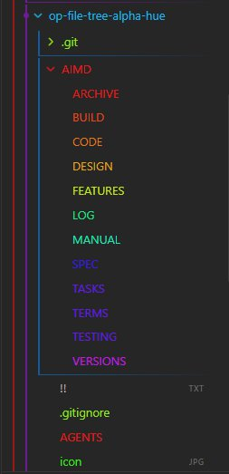

<!-- # TEMPLATE: README.template.md -->


<!-- markdownlint-disable MD013 -->
# README

Colors Obsidian file explorer elements based on folder depth using a 12-point hue spectrum left-border and gradient bottom-border.



[](https://www.buymeacoffee.com/markcrobbins)

<p align="center">
  <a href="https://buymeacoffee.com" target="_blank">
    
  </a>
</p>

## 📑 AI Primary Files
- 🔹 [AGENTS.md](AGENTS.md)
- 🔹 [ARCHIVE.md](AIMD/ARCHIVE.md)
- 🔹 [BUILD.md](AIMD/BUILD.md)
- 🔹 [CODE.md](AIMD/CODE.md)
- 🔹 [DESIGN.md](AIMD/DESIGN.md)
- 🔹 [FEATURES.md](AIMD/FEATURES.md)
- 🔹 [LOG.md](AIMD/LOG.md)
- 🔹 [MANUAL.md](AIMD/MANUAL.md)
- 🔸 [README.md](README.md)
- 🔹 [SPEC.md](AIMD/SPEC.md)
- 🔹 [TASKS.md](AIMD/TASKS.md)
- 🔹 [TERMS.md](AIMD/TERMS.md)
- 🔹 [TESTING.md](AIMD/TESTING.md)
- 🔹 [VERSIONS.md](AIMD/VERSIONS.md)

## 🔍 Table of Contents
- [[#🎯 Project Abstract & Core Value]] ^toc-abstract
- [[#🛠️ Technology Stack at a Glance]] ^toc-stack
- [[#🗺️ Project Layout Blueprint]] ^toc-blueprint
- [[#⚡ Quick Start for AI Developers]] ^toc-quickstart
- [[#Go to...]] ^toc-goto

## 🎯 Project Abstract & Core Value
[[#^toc-abstract|TOC]]
- A high-performance Obsidian user interface plugin that scans the file explorer sidebar layout, calculates nested folder tree depths, and processes alphabetical token indicators on the fly. By appending stateless custom data markers (`data-nav-depth` and `data-alpha-char`), it handles 26-tier alpha spectrum styling alongside a repeating 6-tier nested gradient border matrix, providing spatial index memory optimization across data-heavy vaults while keeping the Chromium UI thread smooth.

---

## 🛠️ Technology Stack at a Glance
[[#^toc-stack|TOC]]
- **Target Operating System:** Cross-platform (Windows, macOS, Linux desktop targets running Obsidian native application frames)
- **Core Languages & Runtimes:** JavaScript ECMAScript 6+ standard (CommonJS module delivery format), Chromium V8 Engine core environment
- **Integrations:** Obsidian Plugin Framework Architecture (`Plugin`, workspace layout lifecycle hooks, `debounce` timers), HTML5 DOM API, native browser `MutationObserver` engine, custom delegated UI pointer interaction listeners

---

## 🗺️ Project Layout Blueprint
[[#^toc-blueprint|TOC]]
- **`AGENTS.md`** ➔ System prompts and operational boundaries for AI teammates.
- **`AIMD/ARCHIVE.md`** ➔ Scriptorium for scrapped ideas and sunset components.
- **`AIMD/BUILD.md`** ➔ Compiler pipelines, flags, and packaging steps.
- **`AIMD/CODE.md`** ➔ Syntax style guidelines and error-handling mandates.
- **`AIMD/DESIGN.md`** ➔ Structural topology, design patterns, and data flows.
- **`AIMD/FEATURES.md`** ➔ Capability matrices and functional product roadmap.
- **`AIMD/LOG.md`** ➔ Chronological audit trail of development decisions.
- **`AIMD/MANUAL.md`** ➔ Installation, user runbooks, and diagnostic workflows.
- **`README.md`** ➔ Primary entry point and structural system abstract.
- **`AIMD/SPEC.md`** ➔ Technical constraints, parameters, and protocol definitions.
- **`AIMD/TASKS.md`** ➔ Dynamic task board and backlog management queue.
- **`AIMD/TERMS.md`** ➔ Technical glossary, definitions, and vocabulary indexes.
- **`AIMD/TESTING.md`** ➔ Automation suites, edge cases, and QA assertion routines.
- **`AIMD/VERSIONS.md`** ➔ Change trackers and version milestone evolution lists.

---

## ⚡ Quick Start for AI Developers
[[#^toc-quickstart|TOC]]

### 1. Verify Environment
```cmd
node -v && npm -v
```

### 2. Compile & Run Tests
```cmd
npm install && npm run build && node -e "require('./main.js')"
```

---
## 🚀 Go to...
[[#^toc-goto|TOC]]
- 🔹 [AGENTS.md](AGENTS.md)
- 🔹 [ARCHIVE.md](AIMD/ARCHIVE.md)
- 🔹 [BUILD.md](AIMD/BUILD.md)
- 🔹 [CODE.md](AIMD/CODE.md)
- 🔹 [DESIGN.md](AIMD/DESIGN.md)
- 🔹 [FEATURES.md](AIMD/FEATURES.md)
- 🔹 [LOG.md](AIMD/LOG.md)
- 🔹 [MANUAL.md](AIMD/MANUAL.md)
- 🔸 [README.md](README.md)
- 🔹 [SPEC.md](AIMD/SPEC.md)
- 🔹 [TASKS.md](AIMD/TASKS.md)
- 🔹 [TERMS.md](AIMD/TERMS.md)
- 🔹 [TESTING.md](AIMD/TESTING.md)
- 🔹 [VERSIONS.md](AIMD/VERSIONS.md)

<!-- # TEMPLATE: README.template.md -->
